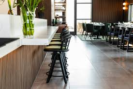

# About Me
**Hey there, I’m Romand from Portland, Oregon!** 👋  

As a **Data Analyst**, I blend my experience in **food and beverage hospitality** where I spent over a decade mastering the art of problem-solving, efficiency, and delivering top-tier experiences. Now, I apply that same mindset to **data analytics**, uncovering trends, optimizing operations, and helping businesses make smarter decisions. 

**My fascination with data** started with an early love for **sports analytics, especially basketball stats.** I was always intrigued by how **numbers and data points** could **tell a bigger story**—whether it was tracking player performance or understanding team dynamics. By analyzing **metrics** like **points scored, plus-minus, and player efficiency ratings**, I saw how stats could reveal how **individual players impact team performance, identify strengths and weaknesses, and guide strategy.**

As I grew, this curiosity naturally expanded into a broader interest in how **data could be applied to solve real-world problems.** My background in **customer service** opened my eyes to the **power of data in business, particularly in optimizing operations and improving customer experiences.**

Over time, I realized that **data wasn’t just about numbers**, but about **uncovering hidden insights that could drive smarter decisions and create meaningful change**. Now, as I dive deeper into data analytics, I’m **passionate** about using data to solve challenges, identify trends, and help businesses and individuals make informed decisions that have a tangible impact.

## 🍽️ From Hospitality to Data  
Working in fast-paced restaurant environments taught me how to **adapt, analyze, and improve** on the fly. Whether it was streamlining workflows, understanding customer behavior, or ensuring smooth service during rush hours, I was always looking for ways to make things better. Now, I do the same with **SQL, Power BI, and Excel**—except instead of food orders, I’m crunching numbers and building dashboards.  

## 🏀 Data with a Purpose  
I see data as a team sport:  
🏆 **Slam dunks** = When data drives meaningful **business transformation**.  
💭 **Assists** = Helping teams make **data-informed decisions** that lead to action.  
❌ **Airballs** = Every missed shot is an opportunity to **refine strategies**.  

## 💻 My Tech Stack  
- **Data Visualization**: Power BI, Excel (PivotTables, Charts)  
- **Data Analysis**: SQL, Spreadsheets  
- **Business Intelligence**: Customer & Market Insights, Survey Design  

## 🔥 What I’m Working On  
### ☕ **Maven Roaster Sales Analysis**  
I’m currently transforming **transactional data** from a multi-location coffee chain into a **dynamic dashboard** that provides insights on **sales patterns**, **staffing efficiency**, and **customer behavior**.  

### 🎯 **Coaching & Leadership Survey Analysis**  
Developing surveys and analyzing responses to help **coaches refine their strategies** based on real feedback and impact measurement.  

  <!-- Box 1 -->
  

    
    
Project 1

  

  <!-- Box 2 -->
  

    
    
Project 2

  

## 📬 Let’s Connect!  
Let’s connect and discover how we can transform data into meaningful insights and harness its full potential!
- [Email Me](mailto:romandkuang@gmail.com)  
- [LinkedIn](linkedin.com/in/romand-kuang-6b3b5446/)  
- [Portfolio](#)  
- [GitHub](https://github.com/romandkuang)  

<!--
**romandkuang/romandkuang** is a ✨ _special_ ✨ repository because its `README.md` (this file) appears on your GitHub profile.

Here are some ideas to get you started:

- 🔭 I’m currently working on ...
- 🌱 I’m currently learning ...
- 👯 I’m looking to collaborate on ...
- 🤔 I’m looking for help with ...
- 💬 Ask me about ...
- 📫 How to reach me: ...
- 😄 Pronouns: ...
- ⚡ Fun fact: ...
-->
